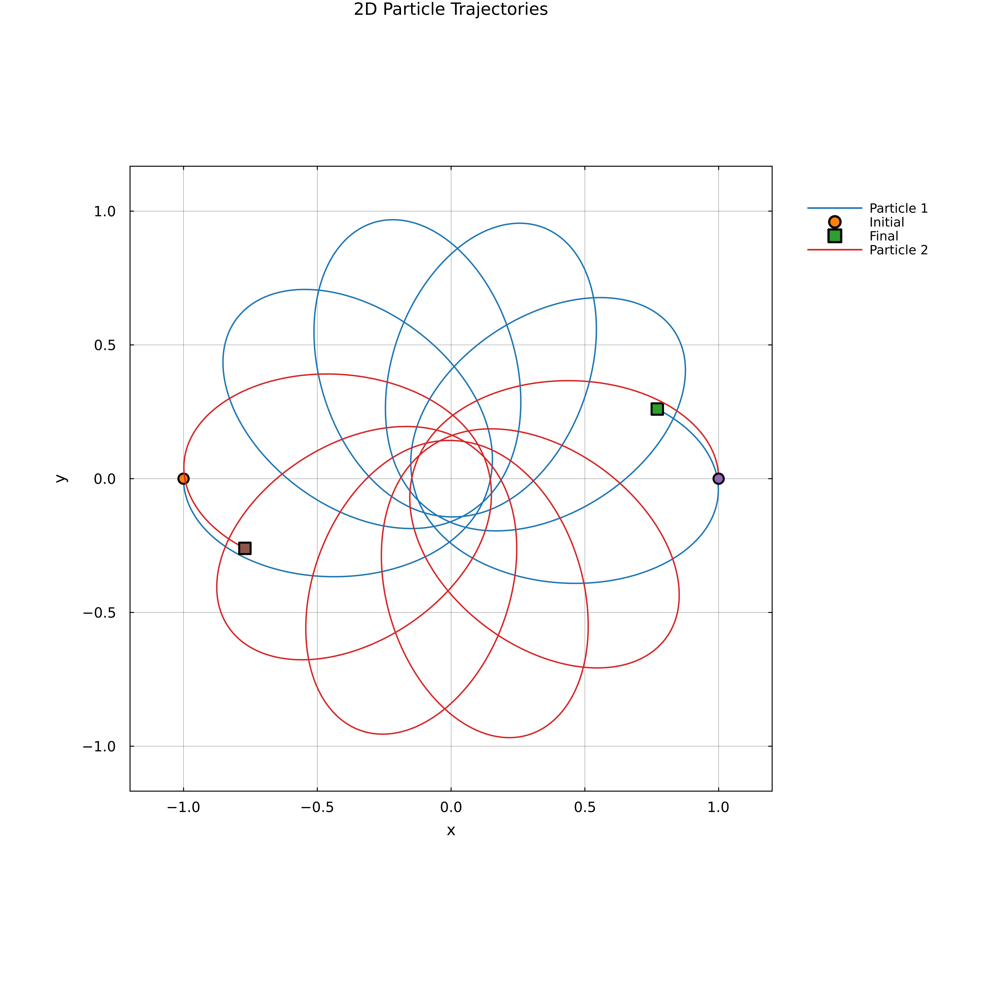
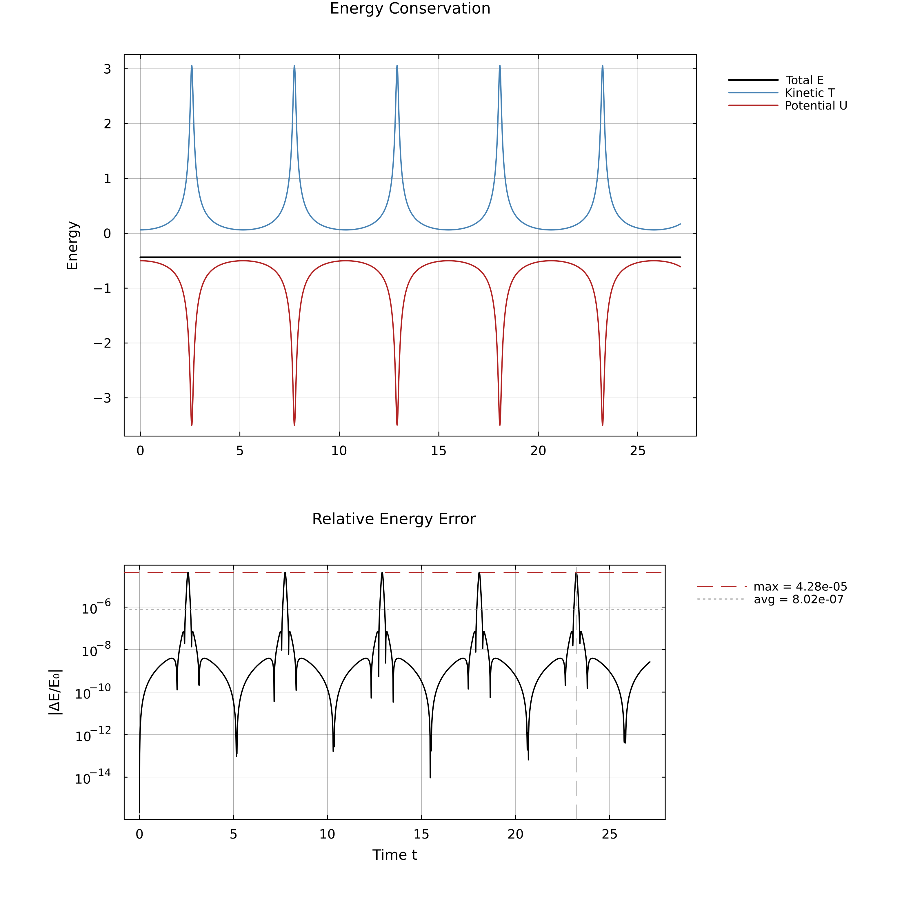

# WeberElectrodynamics.jl

[](https://github.com/WeberElectrodynamics/WeberElectrodynamics.jl/actions/workflows/CI.yml)
[](https://WeberElectrodynamics.github.io/WeberElectrodynamics.jl/stable)
[](https://WeberElectrodynamics.github.io/WeberElectrodynamics.jl/dev)
[](https://codecov.io/gh/WeberElectrodynamics/WeberElectrodynamics.jl)
[](https://julialang.org)
[](https://opensource.org/licenses/MIT)
[](https://doi.org/10.5281/zenodo.19239678)

A Julia package for symplectic numerical integration of n-body Weber electrodynamics.

## Paper

[](https://doi.org/10.5281/zenodo.19337293) [](https://creativecommons.org/licenses/by/4.0/)

**[Computational Weber electrodynamics: symplectic n-body integration](https://doi.org/10.5281/zenodo.19337293)**

## Theory

- [Weber Electrodynamics](theory/WeberElectrodynamics.md) — potential, force, Lagrangian and Hamiltonian formulation, equations of motion
- [Semi-Explicit Symplectic Integrator](theory/SemiExplicitIntegrator.md) — extended phase space, Strang splitting, symmetric projection algorithm

## Extensions

- **WeberElectrodynamicsPlotsExt** — static plotting of trajectories, energy, forces, momentum and phase space
- **WeberElectrodynamicsMakieExt** — real-time animated dashboard with any Makie backend (GLMakie, CairoMakie, WGLMakie)

## Examples

The [examples/](examples/) directory contains [`two_body_reference.ipynb`](examples/two_body_reference.ipynb) — the canonical annotated two-body tutorial with every diagnostic plot. Additional studies (regularization, critical radius dynamics, Zöllner electrogravity, three- and four-body cases) live under [research/notebooks/](research/notebooks/).

## Installation

```julia
using Pkg
Pkg.add("WeberElectrodynamics")
```

## Quick start

The canonical two-body reference problem — symmetric whole-number initial
conditions producing a precessing ellipse ($e = 3/4$) over five Kepler
periods.

```julia
using WeberElectrodynamics, Plots

system = WeberSystem(2, 2)
prob = WeberProblem(system, (0.0, 27.14),
    [-1.0, 0.0,  1.0, 0.0],        # q(0): particles at (±1, 0)
    [ 0.0, -0.25, 0.0, 0.25];      # p(0): |p| = 1/4 tangential
    masses = [1.0, 1.0], charges = [1.0, -1.0], c = 4.0, dt = 0.001,
)
sol = solve(prob)

plot_trajectories(compute_trajectory_data(sol, 2, 2; stride = 10))
plot_energy(compute_energy_timeseries(sol; stride = 10))
```




See [`examples/two_body_reference.ipynb`](examples/two_body_reference.ipynb)
for the full annotated tutorial with every diagnostic plot.

## License

[MIT](LICENSE)
