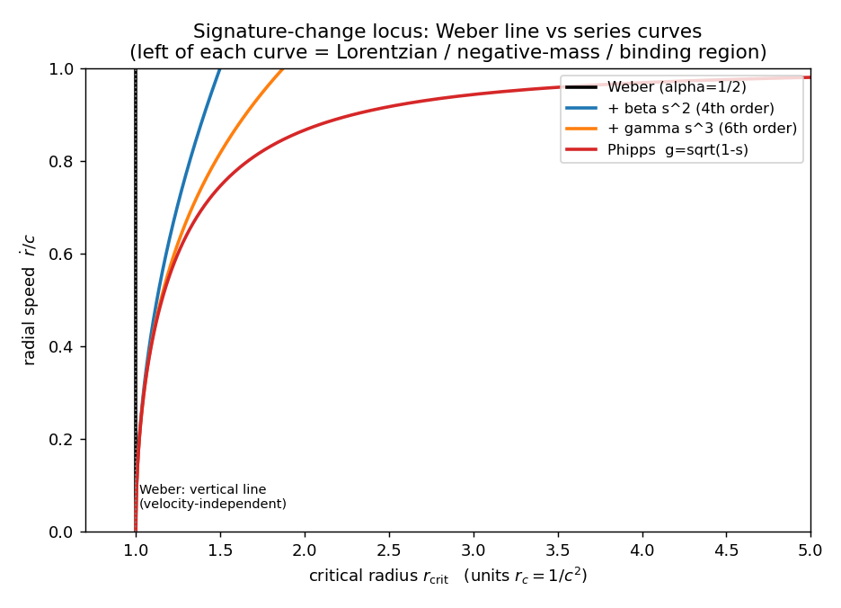
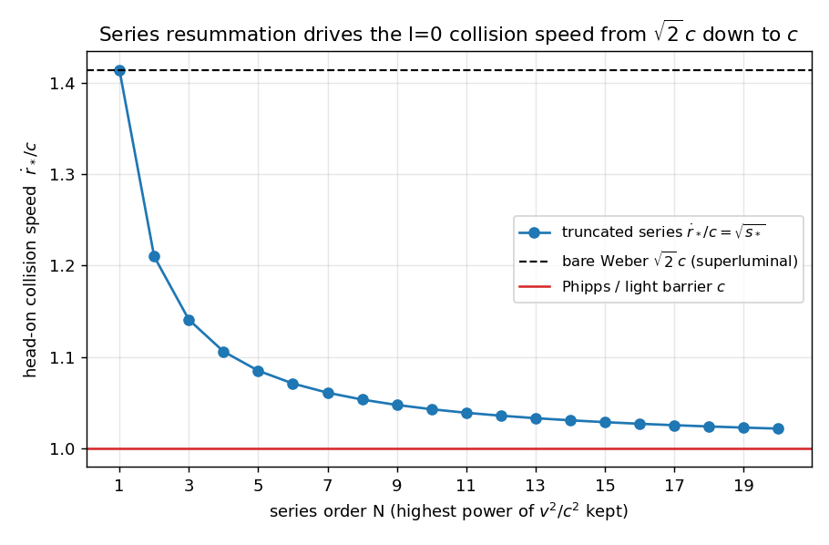
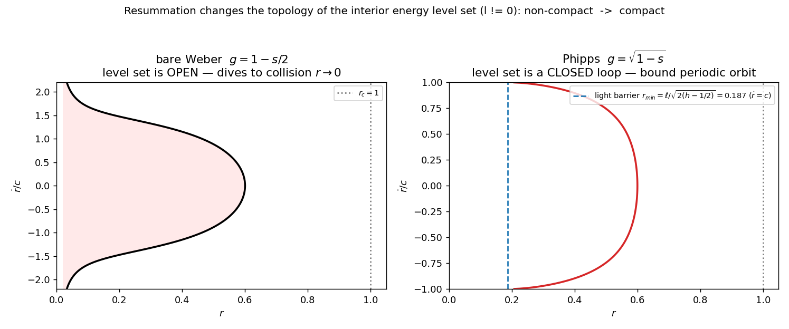
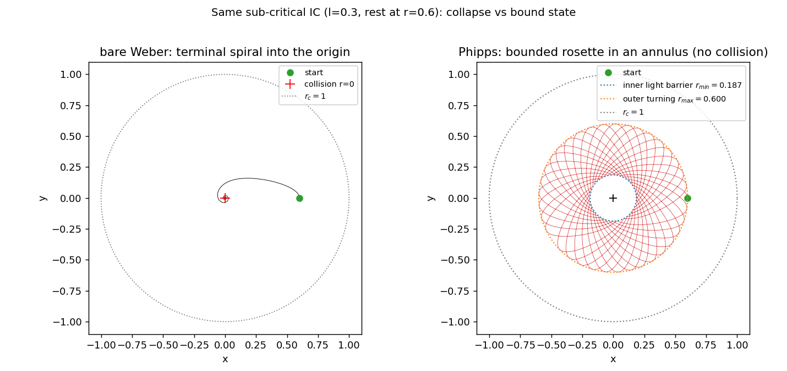

# Series Weber Electrodynamics: Geometry and Topology of the Weber Nucleus under a Higher‑Power Force Law

_Generated: 2026‑05‑30_

**Scripts**: [`SeriesWeber/01_series_force_potential.py`](SeriesWeber/01_series_force_potential.py) (SymPy) ·
[`02_critical_curve.py`](SeriesWeber/02_critical_curve.py) ·
[`03_collision_speed.py`](SeriesWeber/03_collision_speed.py) ·
[`04_phase_topology.py`](SeriesWeber/04_phase_topology.py) ·
[`05_orbits.py`](SeriesWeber/05_orbits.py)
**Reproduce**: `cd SeriesWeber && uv venv --python 3.12 .venv && source .venv/bin/activate && uv pip install sympy numpy scipy matplotlib && for f in 0*.py; do python $f; done`

---

## 0. Scope and summary

Frauenfelder & Weber (2024) gave a complete classical and quantum description of the **Weber
nucleus** — two equal positive charges bound below the critical radius $r_c=1/c^2$ — for the
*bare* Weber force law (second order in $\dot r/c$). Assis (1992, *Can. J. Phys.* **70**, 330)
independently proposed a **series generalisation** of Weber's law carrying terms of fourth and
higher order in $\dot r/c$, in order to derive gravitation as a higher‑order electromagnetic
effect. This note asks a question that, to our knowledge, has not been examined in the
literature: **what happens to the geometry, topology, and dynamics of the Weber nucleus when
Weber's force is replaced by Assis's logical series extension?**

The work here extends Frauenfelder & Weber's program ([`CriticalRadiusAndLikeChargeAttraction.md`](CriticalRadiusAndLikeChargeAttraction.md))
from the single quadratic term to the full series, and connects it to the angular‑momentum
regularization obstruction documented in [`AngularMomentumRegularization.md`](AngularMomentumRegularization.md)
and [`SubCriticalWeberExploration.md`](SubCriticalWeberExploration.md). Every analytic claim below
is verified symbolically with SymPy; every dynamical claim is verified numerically.

**New results.**

1. **The series force law derives from a velocity‑dependent potential and is a Lagrangian /
   Hamiltonian system** for *every* choice of coefficients, with a conserved energy
   $E=\tfrac12\mu\dot r^2+\tfrac{\ell^2}{2\mu r^2}+\tfrac{q_1q_2}{r}\,g(\dot r^2/c^2)$ and a Lagrangian
   whose velocity‑potential carries the **odd denominators** $1,3,5,7,\dots$ (§2–3).
2. **The critical radius becomes a critical *curve*.** Weber's velocity‑independent
   signature‑change radius $r_c$ generalises to a velocity‑dependent locus
   $r_{\rm crit}(\dot r)=-\tfrac{2q_1q_2}{\mu c^2}\,g'(\dot r^2/c^2)$ in the $(r,\dot r)$ phase plane.
   The natural geometry of the series nucleus is **Finsler**, not pseudo‑Riemannian (§4).
3. **The relativistic (Phipps) completion dilates the Weber radius by the Lorentz factor:**
   $r_{\rm crit}(\dot r)=r_c/\sqrt{1-\dot r^2/c^2}=\gamma(\dot r)\,r_c$ (§4).
4. **The series repairs Weber's superluminal head‑on collision.** The $\ell=0$ collision speed
   drops monotonically from Weber's $\sqrt2\,c$ toward **exactly $c$** under resummation (§5).
5. **Resummation changes the topology of the interior motion.** Bare Weber — and *every finite
   truncation* — keeps the terminal collision; only the bounded closed‑form completion replaces it
   with a **finite‑radius light‑speed bounce**, turning the spiral into a bounded annular rosette.
   This produces **bounded recurrent (quasiperiodic, periodic at resonances) interior orbits where
   Frauenfelder & Weber proved bare Weber has none** (§6). It is a *non‑perturbative* resolution of
   the $\ell\neq0$ non‑regularizability obstruction (§7).

> These are mathematical properties of the series‑Weber *model*, stated without prejudice to the
> ongoing physical debate about Weber electrodynamics. Conjectural items are flagged as such.

---

## 1. The series force law and potential (Assis 1992)

Write $r=r_{12}$, $\dot r=\hat r_{12}\!\cdot\!\vec v_{12}$, $s=\dot r^2/c^2$. Assis's generalised
potential and force (his Eqs. [6], [7]) are

$$
U(r,\dot r)=\frac{q_1q_2}{r}\,g(s),\qquad
g(s)=1-\alpha\,s-\beta\,s^2-\gamma\,s^3-\cdots ,
$$

$$
\vec F_{21}=\frac{q_1q_2}{r^2}\,\hat r\!\left[1
-\alpha\frac{\dot r^2-2r\ddot r}{c^2}
-\beta\frac{\dot r^4-4r\dot r^2\ddot r}{c^4}
-\gamma\frac{\dot r^6-6r\dot r^4\ddot r}{c^6}-\cdots\right].
$$

* **Weber** is $\alpha=\tfrac12,\ \beta=\gamma=\dots=0$.
* **Phipps' relativistic potential** $U=\frac{q_1q_2}{r}\sqrt{1-s}$ is the resummation
  $\alpha=\tfrac12,\ \beta=\tfrac18,\ \gamma=\tfrac1{16},\dots$ (verified in
  [`01`](SeriesWeber/01_series_force_potential.py)[5]).

The force follows from the potential by Assis's work/energy route $F=-\hat r\,dU/dr$ with the
chain rule $d\dot r^{2n}/dr=2n\,\dot r^{2n-2}\ddot r$. SymPy confirms the closed form and the
**general $n$‑th term**

$$
\boxed{\;F^{(n)}=a_n\,\frac{q_1q_2}{r^2}\,\frac{\dot r^{2n}-2n\,r\,\dot r^{2n-2}\ddot r}{c^{2n}}\;,\qquad a_0=1,\ a_1=-\alpha,\ a_2=-\beta,\dots\;}
$$

with $F-F_{\text{Assis}[7]}=0$ and the $n$‑th term matching for $n=1\ldots5$ (script `01`, checks
`F - F_Assis[7] = 0` and `general n-th force term … : True`).

---

## 2. The series is an energy‑conserving system

Because $\vec F$ is central and satisfies $\vec v\!\cdot\!\vec F=-dU/dt$ by construction, Newton's
law $\mu\ddot{\vec r}=\vec F$ gives, with no further assumptions,

$$
\frac{d}{dt}\Big(\tfrac12\mu\,\vec v\!\cdot\!\vec v\Big)=\vec F\!\cdot\!\vec v=-\frac{dU}{dt}
\;\Longrightarrow\;
\boxed{\,E=\tfrac12\mu\big(\dot r^2+r^2\dot\phi^2\big)+\frac{q_1q_2}{r}\,g\!\Big(\frac{\dot r^2}{c^2}\Big)=\text{const}\,}
$$

together with angular momentum $\ell=\mu r^2\dot\phi$. So the **whole series family is integrable
in the plane** (two integrals, two degrees of freedom) — exactly like Weber, and for the same
structural reason. Eliminating $\dot\phi$,

$$
E=\tfrac12\mu\dot r^2+\frac{\ell^2}{2\mu r^2}+\frac{q_1q_2}{r}\,g\!\Big(\frac{\dot r^2}{c^2}\Big).
\tag{2.1}
$$

For Weber, $g$ is linear in $\dot r^2$ and (2.1) solves to Frauenfelder's
$\dot r^2=(\ell^2+2r-2hr^2)/\big(r(r_c-r)\big)$ (verified). For the series, (2.1) is **implicit** in
$\dot r^2$ — a polynomial of degree = truncation order — and this is the source of all the new
structure below.

---

## 3. The series Weber Lagrangian — the odd‑denominator signature

The system (2.1) descends from the Lagrangian (verified in `01`[4]):

$$
\boxed{\;L=\tfrac12\mu\big(\dot r^2+r^2\dot\phi^2\big)-\frac{q_1q_2}{r}\,h\!\Big(\frac{\dot r^2}{c^2}\Big),\qquad
h(s)=1+\frac{\alpha}{1}s+\frac{\beta}{3}s^2+\frac{\gamma}{5}s^3+\cdots\;}
$$

The Lagrangian velocity‑potential $h$ and the energy/force generator $g$ are **different**
functions, related by the first‑order ODE $h-2s\,h'=g$ whose regular solution is
$h(s)=1-\sum_{n\ge1}\frac{a_n}{2n-1}s^n$. The denominators $1,3,5,7,\dots=2n-1$ are the structural
fingerprint of the series; for Weber ($n=1$) the denominator is $1$ and we recover Frauenfelder's
$S=\frac{q_1q_2}{r}\big(1+\frac{\dot r^2}{2c^2}\big)$. SymPy confirms that this $L$ reproduces
*both* the Assis force (Euler–Lagrange $-$ Newton $=0$) *and* the energy (Jacobi integral
$\dot r\,\partial_{\dot r}L-L=E$, `True`).

For Phipps, $h(s)=1+\tfrac12 s+\tfrac1{24}s^2+\tfrac1{80}s^3+\cdots$ (script `01`[5]).

---

## 4. The critical radius becomes a critical curve (Finsler signature change)

Frauenfelder's geometric picture: rewriting $L$ so the velocity‑potential joins the kinetic term
gives a metric $g_{rr}=(r-r_c)/r$ that is **Riemannian** for $r>r_c$ and **Lorentzian** for
$r<r_c$, degenerate on the circle $r=r_c=1/c^2$. The coefficient of $\ddot r$ in the radial EOM —
the **effective inertial mass** — is the fibre‑Hessian $m_{\rm eff}=\partial^2 L/\partial\dot r^2$.

For the series this Hessian is **velocity dependent** (SymPy `01`[2]):

$$
\boxed{\;m_{\rm eff}(r,\dot r)=\mu+\frac{2q_1q_2}{r c^2}\,g'\!\Big(\frac{\dot r^2}{c^2}\Big)
=\mu-\frac{2q_1q_2}{rc^2}\Big(\alpha+2\beta\tfrac{\dot r^2}{c^2}+3\gamma\tfrac{\dot r^4}{c^4}+\cdots\Big)\;}
$$

Weber's $\mu(1-r_c/r)$ is the special case $g'=-\tfrac12$. Since $m_{\rm eff}$ depends on the
*velocity*, the configuration‑space metric is replaced by a **Finsler metric** on the tangent
bundle, and the signature‑change set $m_{\rm eff}=0$ is no longer a circle in configuration space
but a **curve in the phase plane**:

$$
\boxed{\;r_{\rm crit}(\dot r)=-\frac{2q_1q_2}{\mu c^2}\,g'\!\Big(\frac{\dot r^2}{c^2}\Big)
= r_c\Big(1+4\beta\tfrac{\dot r^2}{c^2}+6\gamma\tfrac{\dot r^4}{c^4}+\cdots\Big),\qquad r_c=\frac{q_1q_2}{\mu c^2}.\;}
$$

To the left of this curve the radial direction is timelike (negative effective mass, like‑charge
binding); to the right it is spacelike (ordinary repulsion). Bare Weber's binding region is the
half‑plane $r<r_c$; the series **bends the boundary** so that the critical radius *grows with
radial speed* ([Fig. 1](SeriesWeber/figs/02_critical_curve.png)).

| radial speed $\dot r/c$ | Weber | $+\beta$ (4th order) | $+\gamma$ (6th order) | Phipps (full) |
|---|---|---|---|---|
| $0$   | 1.000 | 1.000 | 1.000 | 1.000 |
| $0.5$ | 1.000 | 1.125 | 1.148 | 1.155 |
| $0.9$ | 1.000 | 1.405 | 1.651 | 2.294 |

**The Phipps completion is especially clean:** $g'=-\tfrac1{2\sqrt{1-s}}$ gives

$$
r_{\rm crit}(\dot r)=\frac{r_c}{\sqrt{1-\dot r^2/c^2}}=\gamma(\dot r)\,r_c,
$$

a **Lorentz‑factor dilation of the Weber radius** that diverges as $\dot r\to c$. The binding /
Lorentzian region acquires a built‑in light‑speed wall at $\dot r=c$ that bare Weber (a polynomial,
valid for all $\dot r$) does not have.

---

## 5. The series repairs Weber's superluminal collision ($\ell=0$)

For head‑on motion a particle reaches the collision locus $r\to0$ only if the velocity factor
$g(s)\to0$ there, so that $(1/r)g$ stays finite against the $+1/r$ Coulomb barrier. Hence the
**collision speed is set by the smallest positive root** of $g(s)=0$:

$$
\dot r_{\rm coll}/c=\sqrt{s_*},\qquad g(s_*)=0.
$$

* **Bare Weber** $1-\tfrac12 s=0\Rightarrow s_*=2\Rightarrow \dot r_{\rm coll}=\sqrt2\,c$ —
  *superluminal*, the well‑known awkward feature (Assis–Tajmar 2019).
* **Phipps (full)** $\sqrt{1-s}=0\Rightarrow s_*=1\Rightarrow \dot r_{\rm coll}=c$ — exactly the
  speed of light.

Truncations interpolate monotonically (script `03`, [Fig. 2](SeriesWeber/figs/03_collision_speed.png)):

| order $N$ | 1 (Weber) | 2 | 3 | 4 | 8 | 20 | $\infty$ (Phipps) |
|---|---|---|---|---|---|---|---|
| $\dot r_{\rm coll}/c$ | 1.4142 | 1.2100 | 1.1407 | 1.1058 | 1.0531 | 1.0213 | **1.0000** |

So the higher‑order terms Assis introduced for an entirely different purpose (gravitation) have a
striking side effect: **the resummed force law has a head‑on collision speed of exactly $c$**, curing
Weber's superluminal value. The series order behaves like a regularization parameter for the
strength of the singularity.

---

## 6. Resummation changes the topology of the interior orbit ($\ell\neq0$)

This is the headline result. Frauenfelder & Weber proved that for bare Weber with $\ell\neq0$ the
interior trajectories **spiral into the origin** at infinite speed and infinite winding — there are
**no periodic orbits inside $r_c$**. We show the series can change this.

**Mechanism.** Near $r\to0$, (2.1) requires $\frac{\ell^2}{2\mu r^2}+\frac{q_1q_2}{r}g\to E$ finite,
i.e. the centrifugal $+\infty$ must be cancelled by $\frac{q_1q_2}{r}g\to-\infty$. This needs $g$
to be **unbounded below**.

* Bare Weber ($g=1-\tfrac12 s$) and *every finite truncation* (all higher coefficients negative,
  so $g\to-\infty$ as $s\to\infty$) keep this cancellation → **collision survives**. The level set
  $\{E=h\}$ is **open / non‑compact**, diving to $r=0$
  ([Fig. 3 left](SeriesWeber/figs/04_phase_topology.png)).
* The Phipps completion has $|g|=\sqrt{1-s}\le1$ on its domain $s\le1$. It **cannot** reach
  $-\infty$, so $E\ge\frac{\ell^2}{2\mu r^2}$ and the motion is bounded away from the origin. The
  level set is a **closed loop** ([Fig. 3 right](SeriesWeber/figs/04_phase_topology.png)).

The inner boundary of the Phipps orbit is reached at $s=1$, i.e. the relative radial speed equals
$c$, at the finite radius

$$
r_{\min}=\frac{\ell}{\sqrt{2(h-\tfrac12\mu c^2)/\mu}}\ \xrightarrow{\ \mu=q_1q_2=c=1\ }\ \frac{\ell}{\sqrt{2(h-\tfrac12)}}.
$$

There the orbit hits an **inner light barrier** and reflects in finite time at speed $c$ — a
$C^0$‑continuable bounce that is the direct analogue of Frauenfelder's $\ell=0$, $\sqrt2\,c$ bounce,
but now at finite separation and at non‑zero angular momentum. Reflecting $\dot r\to-\dot r$ at the
$s=1$ surface (energy‑conserving) traces a bounded precessing rosette confined to the annulus
$[r_{\min},r_{\max}]$.

**Numerical confirmation** (script `05`, same sub‑critical IC: $\ell=0.3$, at rest at $r_0=0.6$, in
units $\mu=q_1q_2=c=1$, $r_c=1$):

| model | inner radius | outer radius | max $|\dot r|$ | fate |
|---|---|---|---|---|
| **Weber**  | $\to0$ (collision) | 0.600 | $\to\infty$ | terminal spiral, $\infty$ winding |
| **Phipps** | 0.1868 (predicted 0.1867) | 0.6001 | **1.0000** ($=c$) | bounded rosette, 36 light‑barrier bounces |

The numerically measured inner radius $0.1868$ matches the analytic light barrier $0.1867$ and the
maximum radial speed is exactly $c$. Energy drift over the run is $5\times10^{-6}$ (Weber) and
$3\times10^{-4}$ (Phipps).

So under the resummed series the **Weber nucleus becomes a genuine, collision‑free bound state of
two protons**: a precessing rosette in an annulus walled inside by a light barrier ($\dot r=c$) and
outside by an ordinary turning point ($\dot r=0$). Frauenfelder & Weber proved bare Weber has *no*
bounded recurrent interior orbits (the spiral is always terminal); the resummation supplies them.
In integrable‑systems language, the non‑compact collision cylinders of bare Weber are replaced by
**compact invariant tori** (motion quasiperiodic in general, periodic at resonances).

---

## 7. Interpretation: resummation as non‑perturbative regularization

The repo has documented at length that for bare Weber the $\ell\neq0$ collision is **not
regularizable**: the infinite winding number is a topological obstruction that no smooth coordinate
change removes ([`AngularMomentumRegularization.md`](AngularMomentumRegularization.md),
[`SubCriticalWeberExploration.md`](SubCriticalWeberExploration.md)). The result of §6 gives an
**alternative escape that is invisible at any finite order**:

* The singularity is removed not by a coordinate transform but by **changing the force law to its
  bounded closed form**. Boundedness of $g$ — not high order — is what kills the collision.
* This is genuinely non‑perturbative: the unbounded polynomial truncations all collide; only the
  resummed $\sqrt{1-s}$ (analytic, with a branch point at $s=1$) is bounded. The light barrier is
  the image of that branch point in dynamics.
* The $\ell\neq0$ winding obstruction becomes **moot**, because there is no longer a collision to
  regularize: winding per radial period is finite and the orbit is bounded.

A complementary reading: the series order $N$ is a **regularization parameter**. Increasing $N$
softens the $\ell=0$ collision speed ($\sqrt2\,c\to c$, §5) and — by the same boundedness argument
applied near the origin — softens the $\ell\neq0$ blow‑up of $\dot r$ (an analytic scaling
$\dot r\sim r^{-1/(2N)}$ near the origin for the order‑$N$ truncation, tending to the bounded
$\dot r\le c$ of the resummation as $N\to\infty$).

---

## 8. Geometry and topology not previously described

Collecting the structural novelties relative to Frauenfelder & Weber (2024):

1. **Finsler signature change.** The Weber plane $(\mathbb R^2_\times,g)$ — pseudo‑Riemannian with a
   signature‑change *circle* $r=r_c$ — generalises to a Finsler structure on the tangent bundle
   whose fibre‑Hessian $m_{\rm eff}(r,\dot r)$ degenerates on a signature‑change *curve*
   $r=r_{\rm crit}(\dot r)$. The Riemannian/Lorentzian dichotomy is now a property of *phase space*,
   not configuration space.
2. **Lorentz‑dilated Weber radius.** For the relativistic completion the signature‑change curve is
   exactly $r_c\,\gamma(\dot r)$ — a clean, citable closed form interpolating the whole Assis family.
3. **Topological transition of the integrable foliation.** Inside the nucleus the level sets of
   $(E,\ell)$ transition from non‑compact (collision cylinders, bare Weber and all truncations) to
   compact (invariant tori, bounded resummation). The Weber nucleus acquires bounded periodic /
   quasiperiodic interior orbits.
4. **Inner light barrier.** A new dynamical boundary at finite separation $r_{\min}$ where the
   relative radial speed saturates at $c$, with a $C^0$ bounce — a finite‑separation analogue of the
   $\ell=0$ collision bounce, and a structure with no counterpart in bare Weber.

---

## 9. Open questions / conjectures

* **Quantum series nucleus.** Frauenfelder & Weber built a Weber–Schrödinger equation from the
  Laplace–Beltrami operator of the Lorentzian Weber metric and proved a limit‑circle/limit‑circle
  Sturm–Liouville structure. The series replaces that metric by a **Finsler** one; the natural
  quantisation is a Finsler‑Laplacian (or a velocity‑symbol Weyl quantisation). _Conjecture:_ the
  bounded Phipps completion, having compact interior level sets, yields a **discrete** interior
  spectrum (true bound states), where bare Weber needs externally chosen boundary conditions at the
  collision. This would mirror §6 quantum‑mechanically.
* **General truncation theorems.** Prove the $\dot r\sim r^{-1/(2N)}$ near‑origin scaling and the
  monotone collision‑speed convergence $s_*(N)\downarrow1$ rigorously (only the endpoints and
  $N\le20$ are checked here).
* **Stability and KAM.** Are the interior tori of the Phipps nucleus KAM‑stable under perturbation
  (Zöllner mismatch $a$, third body)? The integrable backbone established in §2 is the right
  starting point.
* **Which completion?** The light barrier and discrete spectrum are properties of the *bounded*
  resummation. Other resummations of [6] with the same first two coefficients but different
  large‑$s$ behaviour would give different inner physics; Assis fixes $\beta,\gamma$ only through
  the gravitational matching $\gamma/\beta=-7/3$. Mapping inner dynamics across admissible
  completions is open.

---

## 10. References

* Assis, A. K. T. "Deriving gravitation from electromagnetism." *Can. J. Phys.* **70**, 330–340
  (1992). [`input/Can-J-Phys-V70-p330-340(1992).pdf`] — series potential [6], force [7].
* Frauenfelder, U., Weber, J. "A mathematical description of the Weber nucleus as a classical and
  quantum mechanical system." *Anal. Math. Phys.* **14**:31 (2024).
  [`input/2207.0070v2.pdf`] — critical radius geometry, Lorentzian Weber metric, classical
  classification (Thm 2.1), Weber–Schrödinger limit‑circle theorem.
* Phipps, T. E. Jr. *Found. Phys. Lett.* — relativistic potential $U\propto\sqrt{1-\dot r^2/c^2}$.
* Assis, A. K. T., Tajmar, M. "Superluminal potentials, forces and accelerations in Weber
  electrodynamics." *J. Adv. Phys.* **8** (2019) — the $\sqrt2\,c$ issue.
* Internal: [`theory/WeberElectrodynamics.md`](../../theory/WeberElectrodynamics.md),
  [`CriticalRadiusAndLikeChargeAttraction.md`](CriticalRadiusAndLikeChargeAttraction.md),
  [`AngularMomentumRegularization.md`](AngularMomentumRegularization.md),
  [`SubCriticalWeberExploration.md`](SubCriticalWeberExploration.md),
  [`theory/ZollnerElectrogravitationalTheory.md`](../../theory/ZollnerElectrogravitationalTheory.md).

---

## Appendix — what is proved vs computed

| Claim | Status | Where |
|---|---|---|
| Series force = Assis [7], general $n$‑th term | SymPy‑proved (n=1..5) | `01`[1] |
| $m_{\rm eff}=\mu+\frac{2q_1q_2}{rc^2}g'$ | SymPy‑proved | `01`[2] |
| Energy integral (2.1) | analytic (work‑energy) + SymPy Jacobi check | §2, `01`[3,4] |
| Odd‑denominator Lagrangian reproduces force & energy | SymPy‑proved | `01`[4] |
| $r_{\rm crit}(\dot r)$, Lorentz dilation | analytic + numeric table | §4, `02` |
| $\ell=0$ collision speed $\sqrt2c\to c$ | numeric (roots), monotone | §5, `03` |
| Interior topology open→closed; light barrier $r_{\min}$ | analytic + numeric (0.1868 vs 0.1867) | §6, `04`,`05` |
| Bounded rosette / periodic interior orbit (Phipps) | numeric (36 bounces, $|\dot r|_{\max}=c$) | §6, `05` |
| Quantum discreteness, KAM, truncation theorems | **conjecture** | §9 |
